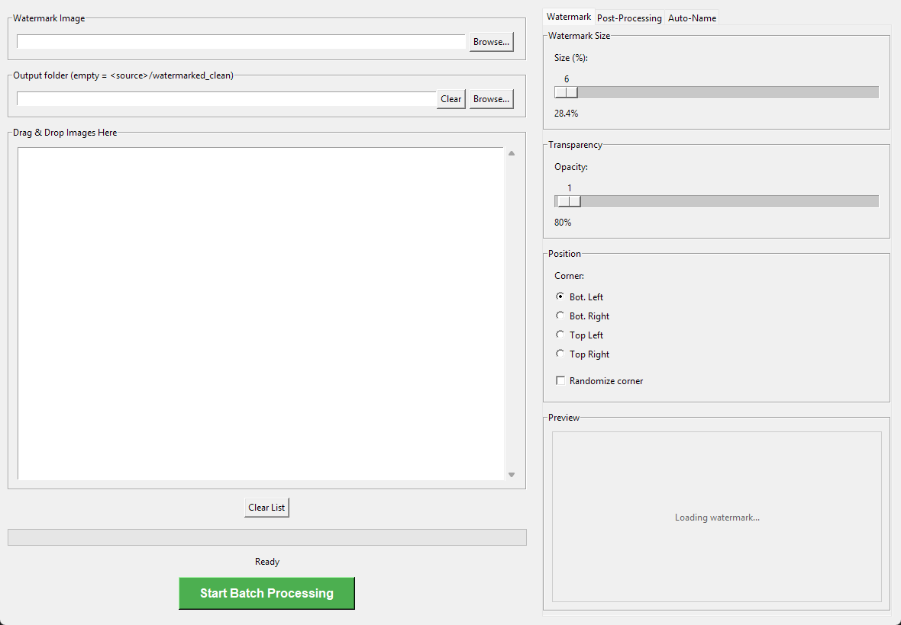

<h1 align="center">Fast Watermark</h1>

<p align="center">
  
  
</p>

<p align="center"><strong>Automatic watermarking tool for AI image creators — batch process, strip metadata, apply filters, and auto-name files by booru character tags.</strong></p>

---

## Who is this for?

AI image creators who generate batches of images and need to:
- Apply a consistent watermark before publishing
- Strip metadata (EXIF, generation parameters)
- Apply post-processing filters
- Auto-rename files using booru character tags extracted from the generation metadata

<p align="center">
  
</p>

## Features

- **Drag & drop** — drop files or folders, no file pickers needed
- **Images & video** — PNG, JPG, MP4, AVI, MOV, MKV
- **Live preview** — see watermark size, opacity, and position update in real time
- **Corner randomization** — watermark shifts to a random corner per image
- **Metadata stripping** — removes EXIF, IPTC, XMP, and JFIF from output files
- **Post-processing pipeline** (disabled by default) — image filters:
  1. Upscale (relative resize)
  2. Kuwahara blur
  3. Median filter
  4. Downscale (relative resize)
  5. Gaussian noise
- **Auto-naming from ComfyUI metadata** — extracts character tags from ComfyUI-generated PNG prompts and renames output files
- **Batch processing** with progress bar

## Quick Start

```bash
pip install pillow opencv-python numpy tkinterdnd2
python FastWatermarkApp.py
```

1. Select a watermark image via **Browse** or drag & drop it onto the field
2. Drag images/videos into the list
3. Tweak settings in the tabs (preview updates live)
4. Click **Start Batch Processing**

Settings persist in `watermark_config.json` next to the script. See `watermark_config.example.json` for defaults.

## Project Structure

| File | Purpose |
|---|---|
| `FastWatermarkApp.py` | Main GUI application |
| `post_filters.py` | Image post-processing pipeline (upscale, Kuwahara, median, downscale, noise) |
| `comfy_metadata.py` | Reads ComfyUI PNG metadata and extracts character tag candidates |


## Building a Standalone .exe

Pre-built binaries are available on the [Releases](https://github.com/Mexes-GM/fast-watermark/releases) page.

To build from source:

```bash
pip install pyinstaller
pyinstaller --noconfirm --onefile --windowed --name=FastWatermark \
    --icon=icon.ico --add-data=icon.ico;. \
    --hidden-import=tkinterdnd2 --hidden-import=PIL._tkinter_finder \
    --collect-all=tkinterdnd2 \
    FastWatermarkApp.py
```

Output: `dist/FastWatermark.exe` (~67 MB, no Python required).

## Dependencies

- **Python** 3.10+
- **Pillow** — image manipulation
- **OpenCV** (`cv2`) — video processing and filters
- **NumPy** — array operations
- **tkinterdnd2** — drag & drop support

## License

MIT — see [LICENSE](LICENSE)
