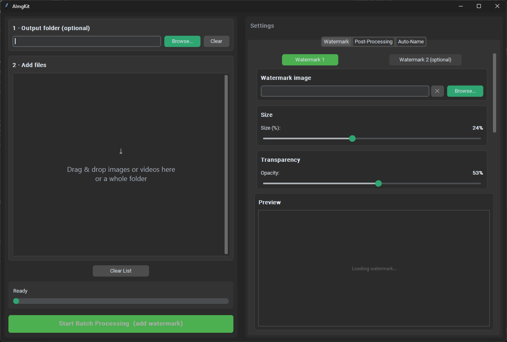

<h1 align="center">AImgKit</h1>

<p align="center">
  
  
  
</p>

<p align="center"><strong>A batch post-production toolkit for AI artists who ship hundreds of images a day — watermark, strip generation metadata, run a configurable filter pipeline, and auto-name files from booru character tags, all in one pass.</strong></p>

<p align="center">
  
</p>

---

## What it is

It started as a tool to slap a watermark on images quickly. It has since grown into a small Swiss-army knife for the last mile of an AI image workflow: the repetitive, easy-to-forget steps.

Point it at a folder, set your defaults once, and every export comes out watermarked, metadata-free, optionally filtered, and sensibly named — without touching the originals.

## Who is this for?

AI artists and creators who generate images and videos in batches and need to:

- Apply one or two consistent watermarks before publishing
- Strip generation metadata (EXIF, ComfyUI prompts/workflow, XMP, ICC)
- Optionally run post-processing filters to alter or finish the output
- Auto-rename files from the character tags embedded in ComfyUI metadata
- Do all of the above to a whole batch at once, not file by file

## Features

- **Drag &amp; drop** — drop files or folders directly onto the list; no file pickers required
- **Dual watermarks** — a primary watermark plus an optional second one, each with independent size, opacity, and corner
- **Corner placement** — pick a fixed corner or randomize per image (consecutive repeats are avoided)
- **Live preview** — size, opacity, and position update in real time as you adjust them
- **Images &amp; video** — PNG, JPG/JPEG, and MP4, AVI, MOV, MKV
- **Metadata stripping** — output files are saved without EXIF, PNG text chunks, XMP, or ICC profiles
- **Configurable post-processing pipeline** (disabled by default) — see below
- **Auto-naming from ComfyUI metadata** — extracts character tag candidates from the positive prompt and renames output files; a character library remembers your past choices (images only)
- **Batch processing** — progress bar with mid-batch cancel; failures are logged and summarized instead of crashing the run

## Post-processing pipeline

When enabled, filters run in a fixed order. Each step is a no-op at its neutral value, so you only pay for what you turn on:

1. **JPEG artifact removal** — Non-Local Means denoising
2. **Upscale** — relative resize (Lanczos, bicubic, Hamming, bilinear, box, nearest)
3. **Kuwahara blur** — edge-preserving smoothing (mean or gaussian)
4. **Median filter**
5. **Downscale** — relative resize (same sampler options)
6. **Sharpen** — unsharp mask with radius and threshold
7. **Hue / Saturation / Brightness**
8. **Chromatic aberration**
9. **Vignette**
10. **JPEG compression simulation** — quality and chroma subsampling
11. **Film grain** — structured grain, optionally monochromatic
12. **Gaussian noise** — per-channel, optionally monochromatic/inverted

## Installation

### Download (Windows)

Grab the latest `AImgKit.exe` from the [Releases](https://github.com/Mexes-GM/AImgKit/releases) page. No Python required — double-click and run. ffmpeg is bundled, so video audio is preserved automatically.

> **SmartScreen / antivirus warning** — The binary is not code-signed and is shipped as a single-file build (UPX disabled to reduce false positives). Windows SmartScreen or your AV may still flag it as unknown. Click "More info → Run anyway" to proceed, or run from source instead.

### Run from source (any OS)

```bash
pip install -r requirements.txt
python AImgKit.py
```

On Windows, ffmpeg is bundled with the `.exe`; when running from source, video audio is preserved only if `ffmpeg` is available on your `PATH` (or next to the script). Without it, videos are still produced but without audio.

## Usage

1. (Optional) Set an output folder — leave empty to save to `<source>/watermarked_clean`
2. Add a watermark image via **Browse** or drag &amp; drop; optionally enable **Watermark 2**
3. Drag images/videos into the list
4. Adjust settings across the **Watermark**, **Post-Processing**, and **Auto-Name** tabs (preview updates live)
5. Click **Start Batch Processing**

Settings, the character library, and logs are stored per user:

- **Windows:** `%LOCALAPPDATA%\AImgKit\`
- **Other OS:** `~/AImgKit/`

See `watermark_config.example.json` for the full set of defaults.

## Project structure

| Path | Purpose |
|---|---|
| `AImgKit.py` | Main GUI application (CustomTkinter) |
| `post_filters.py` | Post-processing filter implementations and pipeline |
| `comfy_metadata.py` | Reads ComfyUI PNG metadata and extracts character tag candidates |
| `core/` | GUI-independent logic: formats, watermark sizing/placement, corner selection, naming, metadata-free saving |
| `tests/` | pytest suite |

## Building a standalone .exe

Pre-built binaries are on the [Releases](https://github.com/Mexes-GM/AImgKit/releases) page. To build from source:

```bash
pip install -r requirements.txt
pip install pyinstaller
pyinstaller AImgKit.spec
```

The spec file bundles the icon, CustomTkinter/tkinterdnd2 assets, and `ffmpeg.exe` (place it in the project root before building). Output: `dist/AImgKit.exe`.

## Development

```bash
pip install -r requirements.txt -r requirements-dev.txt
pytest -q
```

## Dependencies

- **Python** 3.10+
- **Pillow** — image manipulation
- **OpenCV** (`cv2`) — video processing and filters
- **NumPy** — array operations
- **tkinterdnd2** — drag &amp; drop support
- **customtkinter** — modern themed (dark/light) UI

Exact pinned versions are in `requirements.txt`.

## License

MIT — see [LICENSE](LICENSE)

The Windows build bundles an unmodified static **LGPL** build of `ffmpeg.exe`
(used only to remux audio, as a separate executable). FFmpeg and the other
third-party components retain their own licenses — see
[THIRD_PARTY_NOTICES](THIRD_PARTY_NOTICES.md).
